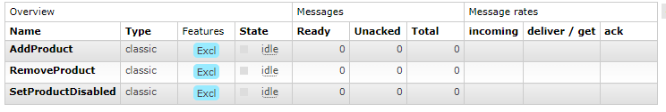
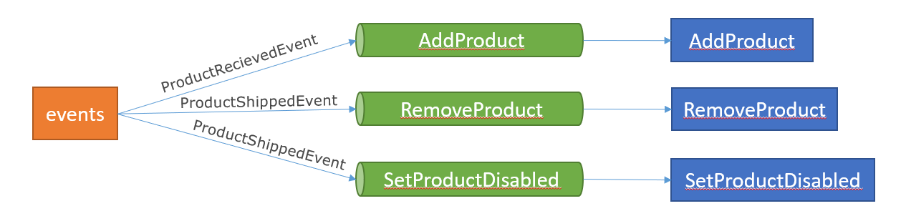

# How to use it:

_tested using python 3.10_

## Run RabbitMQ docker instance

```shell
docker run -d --name rabbitmq -p 5672:5672 -p 15672:15672 rabbitmq:3.11-management
```

## Install pika

In a virtual environment:

```shell
pip install pika
```

## Run subscriber.py

In a terminal

```shell
python ./subscriber.py
```

You should see this output:

```
<SetProductDisabled(Thread-1, initial)> <class '__main__.ProductShippedEvent'>
starting thread...
SetProductDisabled is running
adding thread to the list...
<AddProduct(Thread-2, initial)> <class '__main__.ProductRecievedEvent'>
starting thread...
AddProduct is running
adding thread to the list...
<RemoveProduct(Thread-3, initial)> <class '__main__.ProductShippedEvent'>
starting thread...
RemoveProduct is running
adding thread to the list...
```

## See the queues in RabbitMQ Monitor

go to http://localhost:15672/ and login with id:guest and pwd:guest then clique on **Queues** tab. You should see something like this:


## Use publisher.py to send messages to the queues

To use publisher.py, you should open a new terminal.
If you run:

```shell
python .\publisher.py ProductShippedEvent "Hello I shipped a product"
```

In the subscriber.py terminal these messages should appeared:

```
message type : <class '__main__.ProductShippedEvent'>
message type : <class '__main__.ProductShippedEvent'>
Disable product : Hello I shipped a product
Remove product : Hello I shipped a product
```

If you run:

```shell
python .\publisher.py ProductRecievedEvent "Hello I recieved a product"
```

In the subscriber.py terminal these messages should appeared:

```
message type : <class '__main__.ProductRecievedEvent'>
Add product : Hello I recieved a product
```

Here is the binding:

